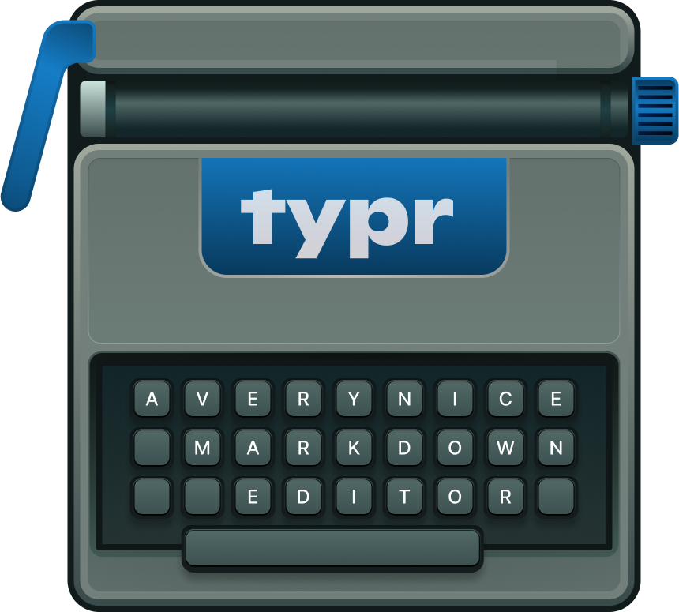
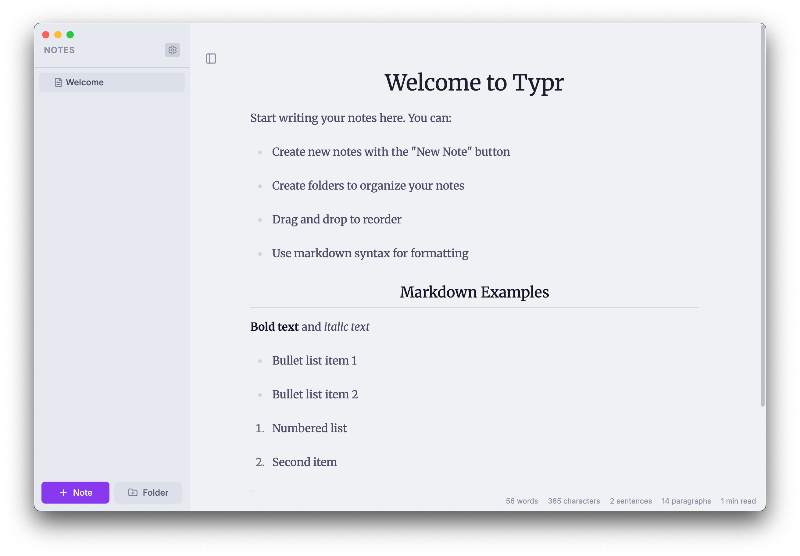
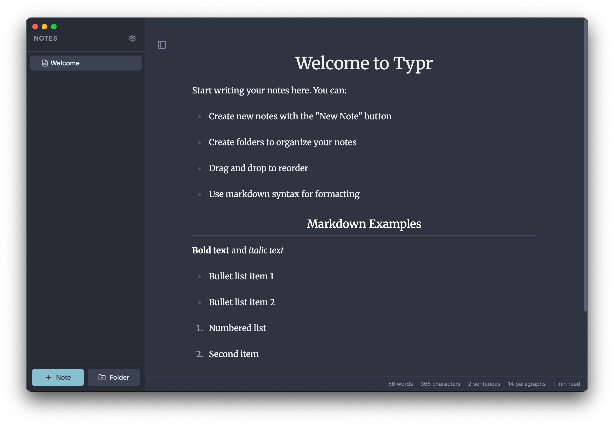

# typr

  

Beautiful markdown editor.

I made this just for me, there are plenty of other markdown editors, I'm pretty sure others would be better for you and will have less bugs.

Typr has **one** feature I could not find in any other: the ability to freely rearange the notes in the sidebar. This is literally why typr exists.

License [MIT](https://rumpl.mit-license.org/)
